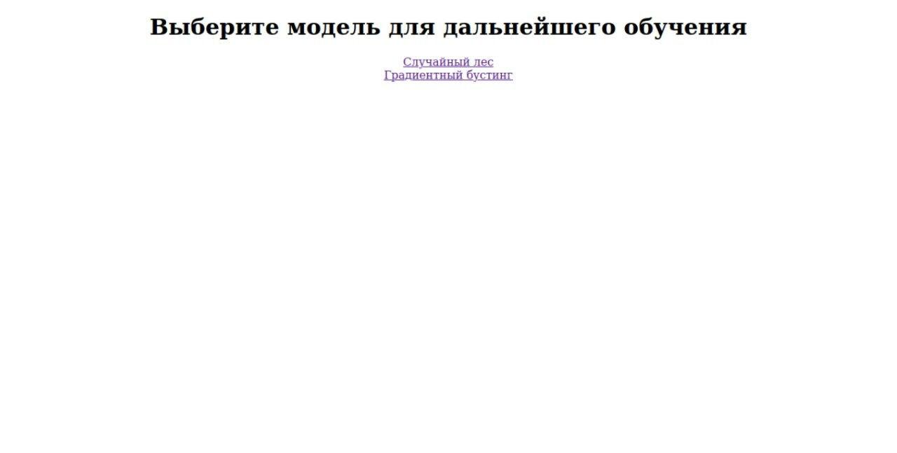

## Задание 3 по практикуму
## Ансамблевые методы машинного обучения. Веб-сервер. Композиции алгоритмов для решения задач машинного обучения
#### Илюхин Владислав, группа 317

Данный markdown-файл содержит описание построенного в результате проделанной работы веб-сервера, опись его функционала и руководство по использованию.

### Стартовая страница

Пользователю предлагаетася два режима работы с сервером - использовать полученные в ходе исследования лучшие модели для случайного леса и градиентного бустинга, либо обучить модели со своими собственными параметрами

### Предсказание лучшими моделями

#### Выбор лучшей модели

Загружаемый файл должен иметь все колонки, присутствующие у датасета по ссылке (кроме, возможно, price). Поддерживаются только датасеты в формате .csv.

#### Получение предсказаний

Предсказания сохраняются в файл results.sav. Также программа выводит RMSE своего вывода в случае, если на загруженном датасете была колонка с правильными ответами.

### Обучение собственных моделей

#### Выбор ансамблевого метода

#### Настройка ансамблевого метода

Здесь пользователю предлагается задать гиперпараметры для выбранного метода обучения - у случайного леса и градиентного бустинга необходимо задать различные наборы.

#### Результат работы

Пользователь получает RMSE своего метода на использованном датасете и может повторить обучение с другой моделю на другом датасете.

### Запуск веб-сервера. Docker-контейнер

Для запуска приложения на своем компьютере пользователю необходимо копировать репозиторий и выполнить в терминале команды сборки и запуска контейнера из родительской директории:

<code>
sudo docker build -t model .
  
sudo docker run -p 5000:5000 -i model
</code>

Альтернативно, пользователь может просто скачать и запустить [образ по ссылке](https://hub.docker.com/repository/docker/gooseit/prac3).
